# Relações entre Entidades - Clean Architecture

## Visão Geral


Este documento descreve como as entidades se relacionam entre si na implementação da Clean Architecture do sistema de gestão financeira.

## 1. Estrutura das Entidades

### Entidades Principais (Existentes)
- **`User`** - O usuário do sistema (root aggregate)
- **`Account`** - Contas bancárias do usuário  
- **`Category`** - Categorias para classificar operações
- **`Operation`** - Operações financeiras (receitas/despesas)
- **`Goal`** - Metas financeiras do usuário

### Novas Entidades (Budget System)
- **`Budget`** - Orçamento mensal/período específico
- **`BudgetItem`** - Itens individuais do orçamento por categoria
- **`MonthlyFinanceSummary`** - Resumo financeiro mensal consolidado

## 2. Tipos de Relações Implementadas

### Relações por Referência (String-based)
```typescript
// Operation referencia Account e Category por string
export interface OperationProps {
  sourceAccount: string;      // Referência ao Account.id
  destinationAccount: string; // Referência ao Account.id  
  category: string;           // Referência ao Category.name
}

// BudgetItem referencia Category por string
export interface BudgetItemProps {
  categoryName: string;       // Referência ao Category.name
}
```

### Relações por Composição (ID-based)
```typescript
// Budget contém BudgetItems
export interface BudgetProps {
  userId: string;             // Referência ao User.id
}

export interface BudgetItemProps {
  budgetId: string;           // Referência ao Budget.id
}

// MonthlyFinanceSummary pertence ao User
export interface MonthlyFinanceSummaryProps {
  userId: string;             // Referência ao User.id
}
```

## 3. Fluxo de Dados Financeiros

### Ciclo de Vida das Operações
1. **`User`** cria **`Operations`** que:
   - Referenciam **`Accounts`** (origem/destino)
   - São classificadas em **`Categories`**
   - Afetam o saldo das contas

### Sistema de Orçamentos
2. **`Budget`** e **`BudgetItems`**:
   - **`User`** cria um **`Budget`** para um período
   - **`Budget`** contém múltiplos **`BudgetItems`** (um por categoria)
   - **`BudgetItems`** fazem referência às **`Categories`** existentes

### Resumos Mensais
3. **`MonthlyFinanceSummary`**:
   - Consolidado automático das **`Operations`** do mês
   - Compara com os valores dos **`BudgetItems`**
   - Calcula métricas como taxa de poupança e aderência ao orçamento

### Metas Financeiras
```typescript
// Goals são independentes mas podem usar dados de Operations
// para calcular progresso
```

## 4. Padrões da Clean Architecture

### Princípios Seguidos

1. **Entities são independentes** - Não dependem de frameworks
2. **Relações por IDs/Strings** - Evita acoplamento direto entre objetos
3. **Imutabilidade** - Todas as entidades são imutáveis
4. **Validação no Domínio** - Regras de negócio nas próprias entidades
5. **Value Objects** - Uso de `Money` para valores monetários

### Agregados Implícitos

```
User (Root Aggregate)
├── Accounts
├── Operations  
├── Goals
├── Budgets
│   └── BudgetItems
└── MonthlyFinanceSummaries
```

## 5. Integração com Outras Camadas

### Data Layer (Repositories)
- Cada entidade tem seu próprio Repository
- Relações são resolvidas na camada de Use Cases
- Mappers convertem entre Entity ↔ DTO

### Use Cases (Domain Layer)
- Coordenam operações entre múltiplas entidades
- Exemplo: `CreateOperationUseCase` pode atualizar Account balance
- Publicam Domain Events para comunicação assíncrona

### Presentation Layer
- View Models agregam dados de múltiplas entidades
- UI Adapters fazem a ponte com componentes React
- Pure Components recebem dados prontos

## 6. Exemplos de Relações

### Criação de uma Operação
```typescript
// 1. User cria Operation
const operation = new Operation({
  id: 'op-123',
  nature: 'expense',
  value: new Money(100, 'BRL'),
  date: new Date(),
  category: 'Alimentação',        // Referência à Category
  sourceAccount: 'account-456',   // Referência à Account
  destinationAccount: 'account-789'
});

// 2. Use Case coordena as atualizações
// - Atualiza saldo da Account
// - Verifica se afeta Budget
// - Atualiza MonthlyFinanceSummary
```

### Criação de um Orçamento
```typescript
// 1. User cria Budget
const budget = new Budget({
  id: 'budget-123',
  userId: 'user-456',             // Referência ao User
  name: 'Orçamento Janeiro 2024',
  startPeriod: new Date('2024-01-01'),
  endPeriod: new Date('2024-01-31'),
  type: 'manual',
  totalPlannedValue: new Money(5000, 'BRL')
});

// 2. User cria BudgetItems para cada categoria
const budgetItem = new BudgetItem({
  id: 'item-123',
  budgetId: 'budget-123',         // Referência ao Budget
  categoryName: 'Alimentação',    // Referência à Category
  plannedValue: new Money(500, 'BRL'),
  categoryType: 'expense'
});
```

## 7. Vantagens desta Abordagem

### Baixo Acoplamento
- Entidades não conhecem outras entidades diretamente
- Mudanças em uma entidade não afetam outras
- Fácil de testar isoladamente

### Alta Coesão
- Cada entidade tem responsabilidades bem definidas
- Regras de negócio encapsuladas
- Validações no domínio

### Flexibilidade
- Fácil adicionar novas entidades
- Relações podem ser alteradas sem afetar entidades
- Suporte a diferentes estratégias de persistência

## 8. Próximos Passos

Para completar a integração das novas entidades:

1. **Repositories** - Implementar persistência
2. **Use Cases** - Criar lógicas de negócio  
3. **Domain Events** - Para comunicação entre agregados
4. **View Models** - Para apresentação dos dados
5. **Migration Strategy** - Para dados existentes

## 9. Considerações de Performance

### Carregamento Lazy
- Relações são resolvidas apenas quando necessário
- Use Cases coordenam o carregamento de dados relacionados

### Cache de Relações
- View Models podem cachear dados frequentemente acessados
- Domain Events podem invalidar cache quando necessário

### Paginação
- Operações e BudgetItems podem ser paginados
- MonthlyFinanceSummary é calculado sob demanda

---

**Nota:** Este documento deve ser atualizado conforme novas entidades são adicionadas ou relações são modificadas.
