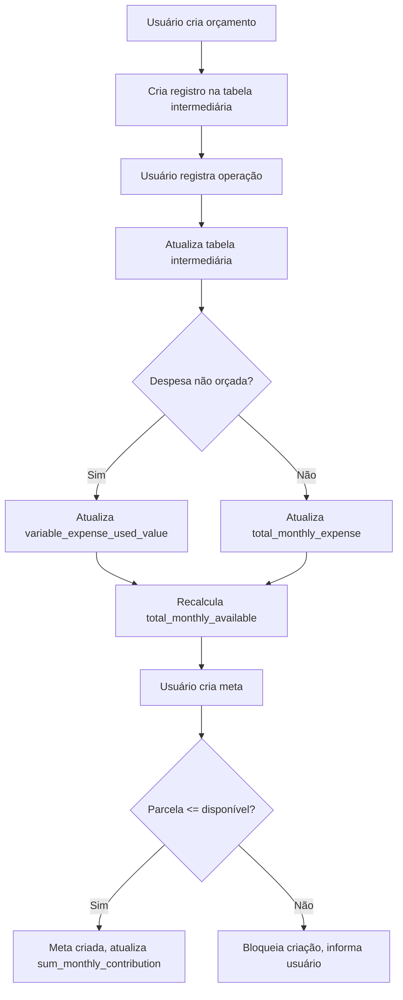

# Sistema de Gestão Financeira Pessoal

## 1. Visão Geral do Sistema

### 1.1 Problema Identificado
Muitas pessoas não conseguem ver propósito em economizar, investir ou fazer dinheiro porque não têm clareza sobre suas recompensas de médio/longo prazo. Sem saber quão perto ou longe estão do destino desejado, acabam utilizando recursos (motivação, energia, esforço, tempo, dinheiro) de forma inadequada e no momento errado.

### 1.2 Objetivo da Solução
Permitir que o usuário seja mais estratégico na utilização de seus recursos, definindo metas monetárias claras, configurando orçamentos realistas e visualizando exatamente quando chegará ao seu destino financeiro.

### 1.3 Metoologia
O sistema utiliza a metodologia SMART para definição de metas:
- **S**pecífica: Meta clara e direta
- **M**ensurável: Valor monetário definido
- **A**tingível: Baseada na realidade financeira atual
- **R**elevante: Importante para o usuário
- **T**emporal: Com prazo definido

## Melhorias futuras

### Caso 1:
Estava pensando comigo uma coisa, apenas liberaremos o renderGoal para o usuário se ele(a) tiver criado um orçamento.

Data do usuário: 01/07/2025
1. Usuário criou orçamento.
- Real: Já temos uma função que calcula o balanço, ou seja, o valor total das receitas menos o das despesas do orçamento. monthlyBudgetPerformance.total_income_planned

Orçamento registrado pelo usuário:
- Receitas(total_income_planned): total = 5000
- Despesas(total_expense_planned): total = 2000
- Data inicio: 01/07/2025
- Data final: 30/09/2025

- Novo serviço à implementar: Usuário criou orçamento? Se sim, vamos liberar a tela para criar metas. Caso contrário, mantenha a tela de metas bloqueada. 

- Nova table à implementar: Entre a table budget e goal, deve haver uma intermediária para salvar dados importantes e gerais. Colunas como: total_monthly_income; total_monthly_expense; start_month(july); end_month[último dia do mês] (july -> 31); variable_expense_max_value[única coluna que recebe UPDATE diretamente digitado pelo user]; total_monthly_available(receita - despesa); 
    - UI à implementar: Deve haver um switch(boolean) no qual o usuário escolhe contar com as receitas variáveis ou não.
    - UI à implementar: Deve haver um campo para o usuário definir o variable_expense_max_value da table intermediária. 
    - Serviço à implementar: O total_monthly_expense é o total de despesas planejadas no orçamento mais(+) qualquer valor que vá além desse total registrado no mês(1 à último dia do mês). Já o total_monthly_income é a soma das receitas planejadas pelo usuário. Se por acaso o usuário tem receitas variáveis temporais, e caso queira que essas receitas variaveis sejam somados à total_monthly_income do mês, o usuário pode fazer isso através desse switch ao deixar (true). Diferentemente do total_monthly_expense que já soma automaticamente.

----------------------------

Data do usuário 05/07/2025
#### Primeira meta.

**Table intermediária**:
- total_monthly_income = 5000
- total_monthly_expense = 2000
- variable_expense_max_value = 900
- variable_expense_used_value = 0
- total_monthly_available(total_monthly_income - total_monthly_expense - variable_expense_max_value - sum_monthly_contribution ) = 2100(5000-2000-900-sum_monthly_contribution)
- start_month = 01/07/2025(july);
- end_month = 31/07/2025(july);

- sum_monthly_contribution: Soma das contribuições mensais para metas ativas no mês.
    - Serviço à implementar: Certifique-se de que, ao criar uma nova meta, o valor da contribuição mensal seja imediatamente subtraído do total_monthly_available daquele mês, mesmo que a meta comece no meio do mês. Se a meta começa em um mês futuro, a subtração só deve ocorrer a partir desse mês "futuro".

**Table goal**:
1. description TEXT: celular.
2. type TEXT: compra.
3. target_value REAL: 3000
4. Campo do formulário em renderGoal de Renda Mensal apresenta uma valor que vem da table intermediária coluna total_monthly_income, inalterável pelo formulário de meta, de R$ 5000 nesse momento.
- Serviço à ser implementado: Esse valor de total_monthly_income de 5000 é passado para o monthly_income da table goal quando a meta é salva.

5. Campo do formulário em renderGoal de Gasto fixos mensais apresenta um valor inalterável de R$2000 que veio da coluna total_monthly_expense da table intermediária.
- Serviço à ser implementado: Esse valor de total_monthly_expense de 2000 é passado para o fixed_expenses da table goal quando a meta é salva.

6. O campo do formulário em renderGoal de Valor disponível por Mês apresenta um valor inalterável de R$2100 que vem da coluna total_monthly_available da table intermediária.
- Serviço à ser implementado: Esse valor de total_monthly_available(table intermediária) de 2100 é passado para o available_per_month da table goal quando a meta é salva.
7. Agora o usuário digita o número de prioridade da meta(1-5)(priority goal.ts) 
8. Digita em texto a importância da meta.
9. No campo estratégia, o usuário vê a sugestão do sistema em como conquistar a meta utilizando-se 100% do valor apresentado no campo Valor disponível por Mês que nesse caso é R$2100.
- Exemplo: 3x de 1500 = 3000(target_value) -> 2 meses de contribuição para conquistar a meta.
- UI à implementar: O usuário, nesse container de Estratégia, tem acesso à um botão de seleção onde pode digitar(num > 0) em quantos meses quer contribuir
- Serviço à implementar: Suponhamos que o usuário digitou 3 no campo de num_parcela. Logo, a função vai calcular para ele 3000(target_value) / 3(num_parcela) = 750. Deve haver um cálculo para ver se o valor por parcela menor ou igual à 2100(total_monthly_available)
- UI à implementar: Nesse exemplo, o número de parcela igual à 3 é permitido pois o valor da parcela é 750 que é menor que 2100, caso fosse maior, então seria bloqueada a ação e informada na tela. Tudo isso para trazer previsibilidade e realismo na geração de meta.

- Atenção: número de parcela = (deve ser armazenado na table goal)
- Alteração na table goal à implementar: adicionar as colunas de número de parcelas.
- UI à implementar: Contribuição mensal(monthly_contribution): 750
10. Usuário pode escolher no campo de Data início se vai começar no dia atual ou se vai começar no mês que vem.
- Serviço à ser implementado: independente da data que o usuário escolher, que seja considerado o mês antes de tudo, pois o balanço(total_monthly_available) é mensal, não diário ou semanal. Logo, se o valor da parcela do mês é 750, que seja 2100-750 = 1350(novo total_monthly_available).

- Caso problemático à ficar atento: Imagina que o usuário tem disponível por mês esses 2100 e definiu uma meta que vai começar dia 15 do mês que vem. No final do mês atual lhe sobra 2100 + margem. No dia 5 do mês seguinte, ele decidi criar uma meta, e ao definir entrar no form da meta, lhe aparece que o total_monthly_available é de 2100, pois não tinha o serviço de subtrair o total_monthly_available com o valor da parcela da meta que vai iniciar no dia 15 do mês, logo a falta desse serviço de atualizar o total_monthly_available no mês, mesmo que uma meta venha a acontecer dias depois, ainda no mesmo mês, pode fazer com que o usuário cometa o erro de definir uma meta contando com o total_monthly_available de 2100, sendo que ele menos que aquilo.

11. Usuário registrou a meta.

- Acasos: Um dos problemas que temos ao criar orçamento e metas é que sempre há despesas não fixas. 

Suponhamos que o usuário salvou essa meta.
O que o sistema tem de informação, após ele(a) ter salvo a meta?
- total_monthly_income = 5000
- total_monthly_expense = 2000
- variable_expense_max_value = 900
- variable_expense_used_value = 0
- total_monthly_available(total_monthly_income - total_monthly_expense - variable_expense_max_value - sum_monthly_contribution) = 1350(5000-2000-900-750)
- start_month = 01/07/2025(july);
- end_month = 30/10/2025(september);

15/07/2025
#### Segunda meta.
O usuário foi criar sua segunda meta.
1. description TEXT: tênis.
2. type TEXT: compra.
3. target_value REAL: 400
4. Campo do formulário em renderGoal de Renda Mensal apresenta uma valor que vem da table intermediária coluna total_monthly_income, inalterável pelo formulário de meta, de R$ 5000 nesse momento.
- Serviço à ser implementado: Esse valor de total_monthly_income de 5000 é passado para o monthly_income da table goal quando a meta é salva.

5. Campo do formulário em renderGoal de Gasto fixos mensais apresenta um valor inalterável de R$2000 que veio da coluna total_monthly_expense da table intermediária.
- Serviço à ser implementado: Esse valor de total_monthly_expense de 2000 é passado para o fixed_expenses da table goal quando a meta é salva.

6. O campo do formulário em renderGoal de Valor disponível por Mês apresenta um valor inalterável de R$1350 que vem da coluna total_monthly_available da table intermediária.
- Serviço à ser implementado: Esse valor de total_monthly_available(table intermediária) de 1350 é passado para o available_per_month da table goal quando a meta é salva.
7. Agora o usuário digita o número de prioridade da meta(1-5)(priority goal.ts) 
8. Digita em texto a importância da meta.
9. No campo estratégia, o usuário vê a sugestão do sistema em como conquistar a meta utilizando-se 100% do valor apresentado no campo Valor disponível por Mês que nesse caso é R$1350.
- Exemplo: 1x de 400 = 400(target_value) -> 1 meses de contribuição.
- Exemplo: 4x de 100 = 400(target_value) -> 4 meses de contribuição.
- UI à implementar: O usuário, nesse container de Estratégia, tem acesso à um textField onde pode digitar(num > 0) em quantos meses quer contribuir
- Serviço à implementar: Suponhamos que o usuário digitou 3 no campo de num_parcela. Logo, a função vai calcular para ele 400(target_value) / 3(num_parcela) = 133.33. Deve haver um cálculo para ver se o valor por parcela menor ou igual à 1350(total_monthly_available)
- UI à implementar: Nesse exemplo, o número de parcela igual à 1 é permitido pois o valor da parcela é 400 que é menor que 1350, caso fosse maior, então seria bloqueada a ação e informada na tela. Tudo isso para trazer previsibilidade e realismo na geração de meta.

- Atenção: número de parcela = (deve ser armazenado na table goal)
- Alteração na table goal à implementar: adicionar as colunas de número de parcelas.
- UI à implementar: Contribuição mensal(monthly_contribution): 400
10. Usuário pode escolher no campo de Data início se vai começar no dia atual ou se vai começar no mês que vem.
- Serviço à ser implementado: independente da data que o usuário escolher, que seja considerado o mês antes de tudo, pois o balanço(total_monthly_available) é mensal, não diário ou semanal. Logo, se o valor da parcela do mês é 400, que seja 1350-400 = 950(novo total_monthly_available).

11. Usuário registrou a meta.

Suponhamos que o usuário salvou essa meta.
O que o sistema tem de informação, após ele(a) ter salvo a meta?
- total_monthly_income = 5000
- total_monthly_expense = 2000
- variable_expense_max_value = 900
- variable_expense_used_value = 0
- total_monthly_available(total_monthly_income - total_monthly_expense - variable_expense_max_value - sum_monthly_contribution ) = 950(1350-400)
- start_month = 01/07/2025(july);
- end_month = 31/07/2025(july);

---------
17/07/2025
### Operação um

- Contexto: O usuário está com um orçamento ativo.
    Despesas:
    - aluguel = 500;
    - alimento-supermercado = 300;
    - curso-superior = 750;
    - transporte = 200;
    - saneamento-básico = 50;
    - energia-eletrica = 70;
    - internet-movel-residencial = 100;
    - curso-profissionalizante = 30;
    Total = 2000
    Receitas:
    - Salário = 5000

- Caso: Um certo dia, o usuário acabou registrando uma operação da natureza despesa, no pix, de sua conta X(própria) para um supermercado(conta-externa) num valor de 500 na categoria alimento-supermercado.
    Quando o usuário foi ver na sua tela de orçamento, viu que havia um déficit na categoria Alimento-supermercado pois o planejado era R$300, mas o real foi de R$500.
    A pergunta é a seguinte, esse deficit de 200 vai impactar no quanto o usuário tem de total_monthly_expense ou em variable_expense_used_value? Vai afetar o valor de total_monthly_expense apenas, por que a categoria de despesa que sofreu deficit está inclusa no budget. 
- Serviço à implementar: A tabela intermediária de budget e goal vai ter que atualizar mediante uma função que observa se o valor planejado da categoria inclusa no budget é menor que o valor real(registrado), se sim, logo, toda alteração que ultrapasse o valor planejado da categoria que existe dentro da table budget(orçado no orçamento), deve ser somado para atualizar o valor da coluna "total_monthly_expense" da table intermediária.

Portanto, quais são os novos valores na table intermediária?
- total_monthly_income = 5000
- total_monthly_expense = 2200(2000 + 200[deficit])
- variable_expense_max_value = 900
- variable_expense_used_value = 0
- total_monthly_available(total_monthly_income - total_monthly_expense - variable_expense_max_value - sum_monthly_contribution ) = 950(1350-400)
- start_month = 01/07/2025(july);
- end_month = 31/07/2025(july);

### Operação dois
- Contexto: O usuário está com um orçamento ativo.
    Despesas:
    - aluguel = 500;
    - alimento-supermercado = 300(+200 de deficit);
    - curso-superior = 750;
    - transporte = 200;
    - saneamento-básico = 50;
    - energia-eletrica = 70;
    - internet-movel-residencial = 100;
    - curso-profissionalizante = 30;
    Total orçado = 2000
    Receitas:
    - Salário = 5000
    Total orçado = 5000

- Caso:O usuário acabou registrando uma operação da natureza despesa, no pix, de sua conta X(própria) para um bando(conta-externa) num valor de 400 na categoria dívida.
- UI à implementar: No renderBudget, é preciso criar uma seção só para mostrar as categorias que não estão inclusas no budget que foram ligadas à operações do mês, como nesse exemplo a categoria dívida que não está inclusa no orçamento, mas foi vinculada à operação dois. 
    Quando o usuário foi ver na sua tela de orçamento, viu que havia um valor na categoria divida fora do board de categorias e de despesas planejdas do orçamento e por ter sido algo temporál, não quis incluir no orçamento a categoria juntamente com o valor.
    - Pergunta: Esse valor de 400 vai impactar no quanto o usuário tem de total_monthly_expense ou em variable_expense_used_value? Vai afetar o valor de variable_expense_used_value apenas, por que a categoria do tipo despesa não está inclusa no budget. Logo foi algo impensado, rápido, não planejado, uma emergência. Além de impactar o variable_expense_used_value, impacta também o total_monthly_available que vai ter que subtrair o valor pois de alguma forma esse valor veio da receita do usuário.
- Serviço à implementar: A tabela intermediária de budget e goal vai ter que atualizar mediante uma função que observa a função que coleta categorias não inclusas no orçamento do mês para somar os valores "não planejados" e somar(+) à coluna variable_expense_used_value da table intermediária. 
- Serviço à implementar: Se por algum acaso, uma operação despesa com valor chegue a ultrapassar o valor total de variable_expense_max_value, que o registro da operação seja bloqueado. Toda alteração nas operações da nature despesa de categorias que não estão inclusas no orçamento do mês, deve a table intermediaria ser atualizada como também a UI.

Portanto, quais são os novos valores na table intermediária?
- total_monthly_income = 5000
- total_monthly_expense = 2200(2000 + 200[deficit])
- variable_expense_max_value = 900
- variable_expense_used_value = 400(despesa categoria não inclusa em orçamento)
- total_monthly_available(total_monthly_income - total_monthly_expense - variable_expense_margin -  ) = 550(950 - 400)
- start_month = 15/07/2025(july);
- end_month = 31/07/2025(july);

### Operação três
- Contexto: O usuário está com um orçamento ativo.
    Despesas:
    - aluguel = 500;
    - alimento-supermercado = 300(+200 de deficit);
    - curso-superior = 750;
    - transporte = 200;
    - saneamento-básico = 50;
    - energia-eletrica = 70;
    - internet-movel-residencial = 100;
    - curso-profissionalizante = 30;
    Total orçado = 2000
    Receitas:
    - Salário = 5000
    Total orçado = 5000
- Caso: Suponhamos que no mesmo mês o usuário registrou uma operação do tipo receita, de sua contratante, no pix, para sua conta própria, um valor de 1000, categoria PLR/Comissão.

- PerguntaPergunta - Agora, como essa nova operação impacta nas tabelas?
Na budget, vai constar no balanço geral que sua receita planejada fixa foi definida como 5000, e sua receita real estará como 6000(5000 + 1000)
- Renderização de UI: Em budget > categorias, PLR/Comissão estará com o itemStatus igual à "superávit" porque budgetItem.category_type é igual à "income". Se por acaso a categoria não tenha sido registrada no orçamento, ela aparecerá na seção com categorias não planejadas(não orçadas)

- Pergunta: Isso impacta na table intermediária?
Sim.

Como está a table intermediária neste mês de julho após esse caso?
- total_monthly_income = 5000 + 1000(função somadora de superávit que soma os valores de categorias de do tipo receita que são maiores que os valores planejados ou não de categorias) = 6000
- total_monthly_expense = 2200(2000 + 200[deficit])
- variable_expense_max_value = 900
- variable_expense_used_value = 500
- total_monthly_available(total_monthly_income - total_monthly_expense - variable_expense_max_value ) = 1550 (550 + 1000)

Suponhamos que estamos no mês seguinte, agosto, e te pergunto como está a table intermediária.
- total_monthly_income = 5000
- total_monthly_expense = 2000
- variable_expense_max_value = 900
- variable_expense_used_value = 0
- total_monthly_available(total_monthly_income - total_monthly_expense - variable_expense_max_value ) = 2100
- start_month = 01/08/2025(august);
- end_month = 31/08/2025(august);

- Serviço à implementar: query para puxar dados da table intermediária por periodo(component)

### Glossário
Aqui está um glossário detalhado com base nos termos, campos e conceitos recorrentes do seu documento de casos e regras para o fluxo financeiro/orçamentário:

---

## Glossário Soberania Financeira

### **Orçamento (Budget)**
- **Orçamento**: Planejamento financeiro mensal do usuário, contendo receitas e despesas previstas.
- **Receitas planejadas (total_income_planned)**: Soma das receitas que o usuário espera receber no mês.
- **Despesas planejadas (total_expense_planned)**: Soma das despesas que o usuário espera pagar no mês.
- **Categoria orçada**: Categoria de despesa ou receita incluída no orçamento do mês.
- **Categoria não orçada**: Categoria de despesa ou receita que não foi incluída no orçamento, mas pode aparecer em operações reais.

---

### **Tabela Intermediária**
Tabela entre o orçamento e as metas, responsável por consolidar e armazenar dados mensais importantes para o cálculo de metas e acompanhamento financeiro.

- **total_monthly_income**: Soma das receitas planejadas do mês, podendo incluir receitas variáveis se o usuário optar.
- **total_monthly_expense**: Soma das despesas planejadas do mês, acrescida de qualquer valor excedente em categorias orçadas.
- **variable_expense_max_value**: Limite máximo de despesas variáveis permitido no mês, definido pelo usuário.
- **variable_expense_used_value**: Soma das despesas realizadas em categorias não orçadas no mês.
- **total_monthly_available**: Valor disponível no mês para novas metas ou gastos, calculado como:
  ```
  total_monthly_income - total_monthly_expense - variable_expense_max_value - sum_monthly_contribution
  ```
  (ou, em alguns casos, subtraindo variable_expense_used_value no lugar de max_value, conforme a lógica adotada).
- **sum_monthly_contribution**: Soma das contribuições mensais para todas as metas ativas no mês.
- **start_month**: Data de início do período de referência (mês).
- **end_month**: Data de término do período de referência (mês).

---

### **Metas (Goals)**
Objetivos financeiros definidos pelo usuário, como comprar um bem ou juntar determinado valor.

- **description**: Descrição da meta (ex: "celular", "tênis").
- **type**: Tipo da meta (ex: "compra", "reserva").
- **target_value**: Valor total a ser atingido para cumprir a meta.
- **monthly_income**: Valor da renda mensal do usuário no momento da criação da meta (vem da tabela intermediária).
- **fixed_expenses**: Valor das despesas fixas mensais do usuário no momento da criação da meta (vem da tabela intermediária).
- **available_per_month**: Valor disponível por mês para contribuir com a meta (vem da tabela intermediária).
- **priority**: Prioridade da meta (ex: 1 a 5).
- **importance**: Texto explicando a importância da meta para o usuário.
- **num_parcela**: Número de parcelas/mensalidades para atingir a meta.
- **monthly_contribution**: Valor mensal a ser reservado para a meta (target_value / num_parcela).
- **start_date**: Data de início da meta (pode ser o mês atual ou o próximo).
- **strategy**: Sugestão do sistema de como atingir a meta, baseada no valor disponível por mês e no número de parcelas.

---

### **Operações**
Transações financeiras reais registradas pelo usuário.

- **Operação de despesa**: Saída de dinheiro, vinculada a uma categoria (orçada ou não).
- **Operação de receita**: Entrada de dinheiro, vinculada a uma categoria (orçada ou não).
- **Déficit**: Quando o valor real gasto em uma categoria orçada excede o valor planejado.
- **Superávit**: Quando o valor real recebido em uma categoria de receita excede o valor planejado.

---

### **Receitas Variáveis**
- **Receitas variáveis**: Entradas de dinheiro não recorrentes ou não previstas (ex: bônus, comissão, PLR).
- **Switch de receitas variáveis**: Opção na interface para o usuário decidir se receitas variáveis devem ser consideradas no cálculo do total_monthly_income.

---

### **UI/Serviços**
- **renderGoal**: Tela/formulário para criação de metas, liberada apenas se o usuário tiver um orçamento criado.
- **renderBudget**: Tela de acompanhamento do orçamento, incluindo categorias orçadas e não orçadas.
- **Estratégia**: Sugestão automática do sistema para o usuário atingir a meta, baseada no valor disponível e no número de parcelas.
- **Bloqueio de ação**: Impedimento de registrar operações ou metas que excedam limites definidos (ex: limite de despesas variáveis, valor de parcela maior que o disponível).

---

### **Regras e Lógicas**
- **Atualização atômica**: Garantia de que todas as alterações em valores financeiros sejam feitas de forma consistente e sem conflitos.
- **Período de referência**: Todos os cálculos são feitos considerando o mês como unidade básica.
- **Alteração retroativa**: Mudanças em orçamentos/metas de meses passados devem ser tratadas com cuidado para evitar inconsistências históricas.

---

Se quiser, posso transformar esse glossário em um arquivo Markdown ou complementar com diagramas!

Ótimo! Vamos estruturar um passo a passo prático para implementar as mudanças e melhorias descritas no seu documento, focando em **modelagem de dados**, **serviços**, **UI** e **regras de negócio**. O objetivo é garantir que o fluxo de orçamento, metas e operações seja robusto, previsível e fácil de manter.

---

##  **Passo a Passo para Implementação das Mudanças**

---

### **1. Modelagem de Dados**

#### 1.1. Criar a Tabela Intermediária (ex: `MonthlyFinanceSummary`)
- **Campos sugeridos:**
  - `id`
  - `user_id`
  - `start_month`
  - `end_month`
  - `total_monthly_income`
  - `total_monthly_expense`
  - `variable_expense_max_value`
  - `variable_expense_used_value`
  - `total_monthly_available`
  - `sum_monthly_contribution`
  - `created_at`
  - `updated_at`
- **Ações:**
  - Criar migration/estrutura no banco de dados.
  - Garantir que cada mês/usuário tenha um registro único.

#### 1.2. Alterar a tabela/metas (`goal`)
- Adicionar campos:
  - `num_parcela` (número de parcelas)
  - `monthly_contribution` (valor mensal)
  - `monthly_income` (snapshot da renda mensal)
  - `fixed_expenses` (snapshot das despesas fixas)
  - `available_per_month` (snapshot do disponível)
- Atualizar modelos e migrations.

---

### **2. Serviços e Lógicas de Negócio**

#### 2.1. Serviço: Atualização da Tabela Intermediária
- **Quando atualizar:**  
  - Ao criar/editar orçamento
  - Ao registrar operação (receita/despesa)
  - Ao criar/editar meta
- **Lógica:**
  - Recalcular todos os campos da tabela intermediária conforme as regras do glossário.
  - Exemplo de cálculo:
    ```
    total_monthly_income = receitas planejadas + receitas variáveis (se switch = true) + superávit
    total_monthly_expense = despesas planejadas + excesso em categorias orçadas
    variable_expense_used_value = soma das despesas em categorias não orçadas
    total_monthly_available = total_monthly_income - total_monthly_expense - variable_expense_max_value - sum_monthly_contribution
    ```
- **Atenção:**  
  - Se a meta começa em um mês futuro, só subtrair a contribuição a partir desse mês.

#### 2.2. Serviço: Bloqueio de Operações
- **Despesa em categoria não orçada:**  
  - Se `variable_expense_used_value + valor_operação > variable_expense_max_value`, bloquear operação e informar usuário.
- **Meta:**  
  - Se `monthly_contribution > total_monthly_available`, bloquear criação/edição e informar usuário.

#### 2.3. Serviço: Switch de Receitas Variáveis
- Implementar lógica para considerar ou não receitas variáveis no cálculo do `total_monthly_income` conforme escolha do usuário.

#### 2.4. Serviço: Atualização de Metas
- Ao criar/editar meta:
  - Preencher campos snapshot (`monthly_income`, `fixed_expenses`, `available_per_month`) com valores da tabela intermediária do mês de início da meta.
  - Atualizar `sum_monthly_contribution` na tabela intermediária.

---

### **3. UI/UX**

#### 3.1. Tela de Orçamento
- Adicionar seção para categorias não orçadas com operações no mês.
- Exibir claramente o limite e o uso de despesas variáveis.
- Exibir superávit/déficit em categorias.

#### 3.2. Tela de Metas (renderGoal)
- Liberar apenas se houver orçamento criado.
- Exibir campos inalteráveis vindos da tabela intermediária.
- Campo para número de parcelas, com validação automática.
- Exibir sugestão de estratégia.
- Bloquear criação se parcela > disponível.

#### 3.3. Switch de Receitas Variáveis
- Adicionar switch na UI para considerar receitas variáveis.
- Atualizar valores em tempo real ao alternar o switch.

#### 3.4. Campo para variable_expense_max_value
- Permitir ao usuário definir/editar o limite de despesas variáveis do mês.

---

### **4. Regras e Validações**

- **Atualização atômica:**  
  - Sempre que houver alteração relevante, atualizar todos os campos dependentes de forma transacional.
- **Período de referência:**  
  - Todas as operações, metas e cálculos devem ser mensais.
- **Alteração retroativa:**  
  - Definir política: bloquear ou recalcular meses anteriores se houver alteração retroativa.

---

### **5. Testes**

- Testar todos os fluxos:
  - Criação/edição de orçamento
  - Registro de operações (orçadas e não orçadas)
  - Criação/edição de metas (com diferentes datas de início)
  - Alteração de limites e switches
  - Casos de bloqueio (exceder limites)
- Testes unitários e de integração para garantir consistência dos cálculos.

---

### **6. Documentação**

- Atualizar documentação técnica e de usuário:
  - Explicar cada campo e regra.
  - Exemplos de uso e edge cases.
  - Glossário atualizado.

---

## **Resumo Visual do Fluxo**



---

## **Próximos Passos**

1. **Modelar e migrar banco de dados**
2. **Implementar serviços de atualização e validação**
3. **Atualizar e criar componentes de UI**
4. **Testar todos os fluxos**
5. **Documentar e treinar usuários/testadores**

Se quiser, posso começar por qualquer etapa (ex: modelagem, serviço, UI) ou gerar código/migrations para algum ponto específico! Qual parte você quer priorizar?